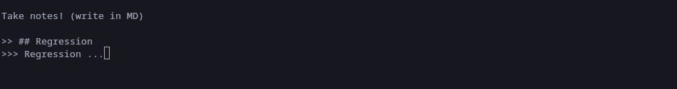

## Quick CLI Program for note taking in Danfe

How do I run the program?

**Clone** the file to your folder

``` sh
git clone https://github.com/danfe-df/cli_notes.git
```

If on linux make an **alias** example for bash
``` sh
nano ~/.bashrc
```

Now go to the end of the file and add 

```
alias note="danfe run ~/folder_path/main.df"
```
*Note: Replace the folder_path to your actual file path*


Source it from the active terminal session
``` sh
source ~/.bashrc
```
Now when you enter note in your terminal, the note app runs.

